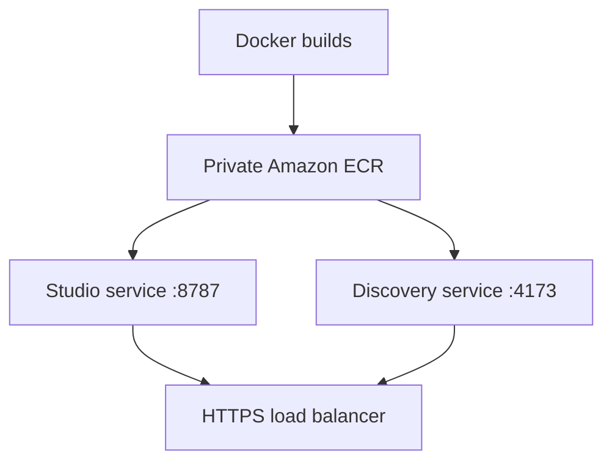

The best deployment path is **private Amazon ECR + two Amazon ECS Express Mode services**. Keep Studio and Discovery separate because they use different ports and health checks. Express Mode provisions Fargate, HTTPS, load balancing, networking, autoscaling, and CloudWatch monitoring automatically. [AWS ECS Express Mode overview](https://docs.aws.amazon.com/AmazonECS/latest/developerguide/express-service-overview.html)



### 1. Prepare your Mac

Install/update the AWS CLI:

```bash
brew install awscli
```

For an AO-managed AWS account, use SSO if available:

```bash
aws configure sso
aws sso login
aws sts get-caller-identity
```

That final command should display the correct AO AWS account before creating anything.

### 2. Create two private ECR repositories

Choose a region—probably `us-east-1` unless AO has specified another:

```bash
DEPLOY_REGION=us-east-1
DEPLOY_ACCOUNT_ID=$(aws sts get-caller-identity --query Account --output text)
DEPLOY_REGISTRY="${DEPLOY_ACCOUNT_ID}.dkr.ecr.${DEPLOY_REGION}.amazonaws.com"
DEPLOY_TAG=v1
```

Create the repositories once:

```bash
aws ecr create-repository \
  --repository-name ao-cc-studio \
  --image-scanning-configuration scanOnPush=true \
  --region "$DEPLOY_REGION"

aws ecr create-repository \
  --repository-name ao-cc-discovery \
  --image-scanning-configuration scanOnPush=true \
  --region "$DEPLOY_REGION"
```

Authenticate Docker:

```bash
aws ecr get-login-password --region "$DEPLOY_REGION" |
docker login \
  --username AWS \
  --password-stdin "$DEPLOY_REGISTRY"
```

AWS documents this ECR authentication and push process [here](https://docs.aws.amazon.com/AmazonECR/latest/userguide/docker-push-ecr-image.html).

### 3. Build and push the images

Because your Mac may use Apple Silicon, explicitly build Linux AMD64 images:

```bash
docker buildx build \
  --platform linux/amd64 \
  --tag "$DEPLOY_REGISTRY/ao-cc-studio:$DEPLOY_TAG" \
  --push \
  ./AO-CC-Studio-Portal-Docker
```

```bash
docker buildx build \
  --platform linux/amd64 \
  --tag "$DEPLOY_REGISTRY/ao-cc-discovery:$DEPLOY_TAG" \
  --push \
  ./AO-CC-Discovery-Portal-Docker
```

You should then see both images under **AWS Console → Elastic Container Registry → Private repositories**.

### 4. Deploy Studio through ECS Express Mode

Open **AWS Console → Elastic Container Service → Express mode → Create**.

Use:

| Setting           | Studio value               |
| ----------------- | -------------------------- |
| Service name      | `ao-cc-studio`             |
| Image             | `ao-cc-studio:v1` from ECR |
| Container port    | `8787`                     |
| Health-check path | `/api/health`              |
| CPU               | `0.25 vCPU`                |
| Memory            | `0.5 GB`                   |
| Minimum tasks     | `1`                        |
| Maximum tasks     | `2`                        |

Environment variables are already included in the image, but you may explicitly enter:

```text
NODE_ENV=production
HOST=0.0.0.0
PORT=8787
```

Let the console create the **task execution role** and **infrastructure role** if they do not already exist. AWS’s exact console process is documented [here](https://docs.aws.amazon.com/AmazonECS/latest/developerguide/express-service-first-run.html).

Once active, Studio will be available at something like:

```text
https://ao-cc-studio.ecs.us-east-1.on.aws/studio
```

### 5. Deploy Discovery

Repeat the same process:

| Setting           | Discovery value               |
| ----------------- | ----------------------------- |
| Service name      | `ao-cc-discovery`             |
| Image             | `ao-cc-discovery:v1` from ECR |
| Container port    | `4173`                        |
| Health-check path | `/`                           |
| CPU               | `0.25 vCPU`                   |
| Memory            | `0.5 GB`                      |
| Minimum tasks     | `1`                           |
| Maximum tasks     | `2`                           |

Environment variables:

```text
NODE_ENV=production
HOST=0.0.0.0
PORT=4173
PORTAL_PROJECT=aws-carddemo-preview
```

Use the same default cluster and VPC for both services. Express Mode can share an Application Load Balancer among services in the same VPC, reducing cost. [AWS resource-sharing details](https://docs.aws.amazon.com/AmazonECS/latest/developerguide/express-service-work.html)

### 6. Verify both deployments

```bash
curl -fsS https://<studio-url>/api/health
curl -I https://<discovery-url>/
```

Then test in a browser:

```text
https://<studio-url>/studio
https://<discovery-url>/
```

Also verify:

* Studio questions reach the MCP bridge.
* Discovery displays the `aws-carddemo-preview` data.
* CloudWatch contains container logs.
* Stopping an ECS task causes ECS to replace it automatically.

### 7. Before sending links to clients

The generated URLs are publicly reachable. Before a client demonstration, I recommend:

* Add authentication if the URLs should not be public.
* Configure AWS Budget alerts and CloudWatch alarms.
* Add custom domains such as `studio.demo.<ao-domain>` and `discovery.demo.<ao-domain>`.
* Use ACM certificates and Route 53 aliases for those domains. AWS provides the Express Mode custom-domain procedure [here](https://docs.aws.amazon.com/AmazonECS/latest/developerguide/express-service-advanced-customization.html#express-service-custom-domain).
* After the first manual deployment succeeds, create GitHub Actions using AWS OIDC to build, scan, push, and redeploy automatically.

At low traffic, with two continuously running `0.25 vCPU/0.5 GB` tasks sharing one load balancer, a rough `us-east-1` estimate is approximately **$35–$45/month**, plus logs and data transfer. This is inferred from current [Fargate pricing](https://aws.amazon.com/fargate/pricing/) and [load-balancer pricing](https://aws.amazon.com/elasticloadbalancing/pricing/).

I would not start a new implementation on App Runner: AWS stopped accepting new App Runner customers on March 31, 2026 and directs new container deployments toward ECS Express Mode.

### 8. AWS CLI Output
#### Profile
We use Continuum Labs

aws sso login --profile ao-cc-studio-portal

aws sts get-caller-identity --profile ao-cc-studio-portal
{
    "UserId": "AROA5YN4EQQBXTFVCO2Q2:Nabil.Sleiman@alphaomega.com",
    "Account": "945824236547",
    "Arn": "arn:aws:sts::945824236547:assumed-role/AWSReservedSSO_AdministratorAccess_7a64ef2812eeea03/Nabil.Sleiman@alphaomega.com"
}

#### AWS Repositories
```bash
aws ecr create-repository \
  --repository-name ao-cc-studio \
  --image-scanning-configuration scanOnPush=true \
  --region "$DEPLOY_REGION"

{
    "repository": {
        "repositoryArn": "arn:aws:ecr:us-east-1:945824236547:repository/ao-cc-studio",
        "registryId": "945824236547",
        "repositoryName": "ao-cc-studio",
        "repositoryUri": "945824236547.dkr.ecr.us-east-1.amazonaws.com/ao-cc-studio",
        "createdAt": "2026-08-07T15:27:49.393000-04:00",
        "imageTagMutability": "MUTABLE",
        "imageScanningConfiguration": {
            "scanOnPush": true
        },
        "encryptionConfiguration": {
            "encryptionType": "AES256"
        }
    }
}

aws ecr create-repository \
  --repository-name ao-cc-discovery \
  --image-scanning-configuration scanOnPush=true \
  --region "$DEPLOY_REGION"

  {
    "repository": {
        "repositoryArn": "arn:aws:ecr:us-east-1:945824236547:repository/ao-cc-discovery",
        "registryId": "945824236547",
        "repositoryName": "ao-cc-discovery",
        "repositoryUri": "945824236547.dkr.ecr.us-east-1.amazonaws.com/ao-cc-discovery",
        "createdAt": "2026-08-07T15:31:33.444000-04:00",
        "imageTagMutability": "MUTABLE",
        "imageScanningConfiguration": {
            "scanOnPush": true
        },
        "encryptionConfiguration": {
            "encryptionType": "AES256"
        }
    }
}

```


